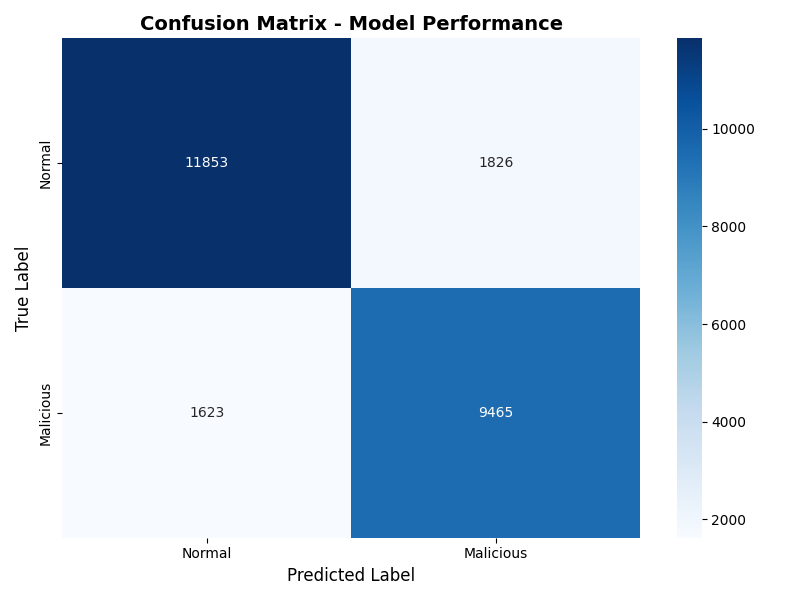
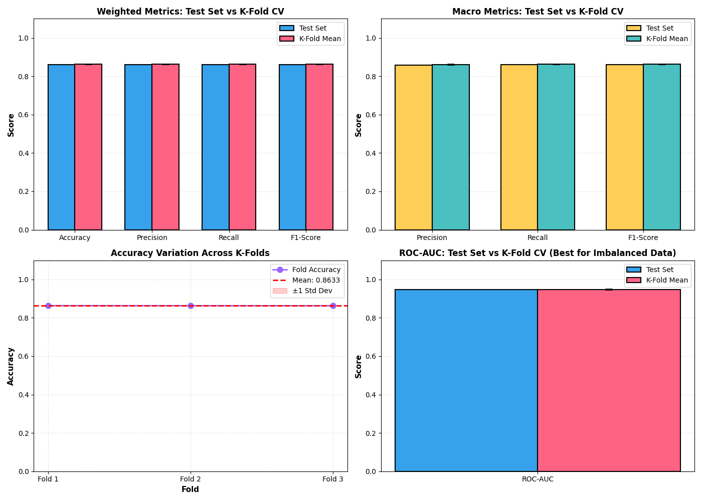
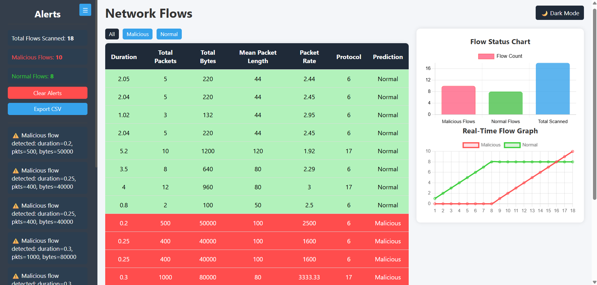
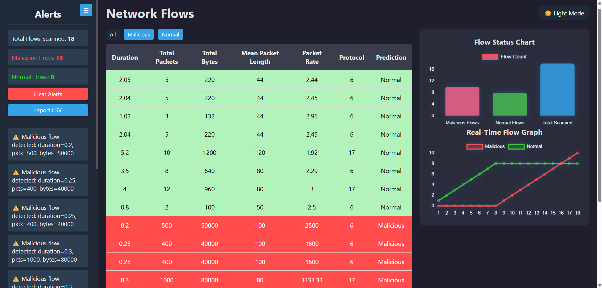

# 🧠 AI Cyber Threat Dashboard

A lightweight, real-time dashboard built to visualize network flow data and detect potential cyber threats using AI predictions.  
The dashboard presents both tabular and graphical insights into network flows and allows you to monitor malicious vs. normal activity in real time.

---

## 🚀 Features

- 📊 **Real-Time Flow Updates** – Displays new network flows one at a time in the table.
- 🔄 **Live Chart Updates** – Line chart automatically updates to reflect the most recent data.
- ⚙️ **AI Prediction Display** – Shows model predictions for each flow (Normal / Malicious).
- 🌗 **Light & Dark Mode** – Easily switch between light and dark themes.
- 📁 **Export Functionality** – Export all displayed flow data to a CSV file.
- 🧭 **Collapsible Sidebar** – Transparent sidebar that can expand or collapse for better visibility.
- 💡 **Responsive Layout** – Chart and table displayed side-by-side for clear, modern visualization.

---

## 🗂️ Project Structure

```
AI-Driven-Cyber-Threat-Detector
│
├── web-dashboard # Main dashboard page
├── datasets # Sample dataset or dataset you want to use
├── java_core # Java components
├── logs # Output logs are saved here after scanning the flows
├── python_ml # Python components (Training the model saves it in the project root)
└── README.md # Project documentation
```

---

## ⚙️ System Workflow

### 🧩 Step-by-Step Process

1. **Packet Capture (Java):**
   - `packetcapture.java` continuously monitors live network traffic.
   - Extracted packets are formatted into flow-based records.

2. **Feature Extraction:**
   - `featureextractor.java` computes attributes like:
     - Flow duration  
     - Packet count  
     - Bytes per second  
     - Mean packet size  
     - Protocol and source/destination ports

3. **Threat Detection (Python):**
   - `predict_server.py` runs a lightweight Python service exposing an ML model via sockets or REST.
   - Java sends extracted flow features to this server.
   - The model (trained using `train_model.py`) returns a label: **Normal** or **Malicious**.

4. **Logging (Java):**
   - If malicious activity is detected, it is recorded in:
     - `logs/alerts.log` (human-readable)
     - `logs/malicious_flows.csv` (structured for analysis)

5. **Visualization (Web Dashboard):**
   - The **web-dashboard** displays:
     - Total flows scanned  
     - Malicious and normal flow counts  
     - Real-time line/bar charts  
     - Live updating table with color-coded rows  

---

## 🧠 AI Model

The system uses a **Random Forest Classifier** (ensemble learning) trained via **`python_ml/train_model.py`**.  
The model analyzes 6 flow features: duration, total packets, total bytes, mean packet length, packet rate, and protocol.  
With 100 decision trees and StandardScaler normalization, it achieves robust real-time threat detection with minimal false positives.

### Model Factors
| Feature | Description |
| --- | --- |
| Duration | Flow lifetime in seconds |
| Total Packets | Count of packets in the flow |
| Total Bytes | Bytes transferred in the flow |
| Mean Packet Length | Average bytes per packet |
| Packet Rate | Packets per second |
| Protocol | Encoded transport protocol (TCP/UDP/ICMP/other) |

### Evaluation Visualizations
- Confusion matrix: 
- Metrics chart (test vs k-fold): 

Example training command:

```
cd python_ml
python train_model.py
```

This will generate and save a trained model file (e.g., model.pkl), which predict_server.py loads for live inference.

---

## 🐍 Python ML Server Setup

1. Navigate to the ML Backend:

```
cd python_ml
```

2. Install dependencies:

```
pip install scikit-learn pandas flask joblib
```

3. Start the prediction server:

```
python predict_server.py
```

4. The server listens on a local port(eg., `http://127.0.0.1:5000`) for feature data sent from java.

---

## ☕ Java Core Setup

1. Navigate to `java_core`:

```
cd java_core
```

2. Compile all java files:
We need to have the gson-x.x.x.jar file in java_core folder for the java components to be compiled

```
javac -cp ".;gson-x.x.x.jar" *.java
```

3. Run the main module:

```
java -cp ".;gson-x.x.x.jar" Main
```

4. The java program:
      - Captures packets
      - Extract features
      - Sends features to Python for classification
      - Logs detected malicious activity
      - Optionally pushes results to the dashboard

---

## 🌐 Web Dashboard Setup

1. Navigate to the dashboard folder:

```
cd web-dashboard
```

2. Open `index.html` in your browser.

3. The dashboard will:
- Display live-updating tables and charts
- Show total flows scanned, alerts, and threat trends
- Automatically update visuals based on `malicious_flows.csv` or simulated live feed in `script.js`
      
---

## 🕵️ Real-Time Detection Procedure

Follow this end-to-end workflow to collect realistic normal traffic, merge it with your attack samples, train the model, and validate real-time detection on the dashboard.

### 1. Collect Normal Baseline
- Run the normal java detector to capture background flows for at least a minute.
- Result: appends normal flows to a CSV under `datasets/`.

Commands (Windows):

```
cd python_ml
python collect_normal_samples.py 
```

- Options:
   - `--duration`: seconds to capture normal traffic
   - `--interface`: capture interface name (e.g., `LOOPBACK`, or an actual NIC)

### 2. Merge Training Data
- Combine your existing attack dataset with the newly collected normal samples.
- Result: a merged training CSV saved under `datasets/` (e.g., `merged_training.csv`).

```
cd python_ml
python merge_training_data.py 
```

### 3. Train the Model
- Retrain the classifier with the merged dataset.
- Output: model artifacts saved next to `python_ml` (loaded by the backend).

```
cd python_ml
python train_model.py 
```

Artifacts expected:
- `rf_model.pkl`
- `scaler.pkl`
- `protocol_label_encoder.pkl`

### 4. Start the Backend API
- Serves prediction endpoints and the dashboard.

```
cd python_ml
python predict_server.py
```

- Endpoints used by the system:
   - `GET /` → serves the dashboard
   - `POST /predict` → single prediction
   - `POST /update_flows` → detector posts window results
   - `GET /get_flows` → dashboard polls flows (includes live + CSV malicious)
   - `GET /get_alerts` → dashboard polls recent alerts from `logs/alerts.log`

### 5. Start the Java Detector (Live Mode)
- Captures packets and pushes flow results to the backend.

```
cd java_core
javac -cp "lib/*" *.java
java -cp "lib/*;." Main --live
```

- Ensure in `config.json` (loaded by `Config`) you have:
   - `interface_name`: e.g., `LOOPBACK` or your NIC name
   - `mlThreshold`: e.g., `0.5`
   - `windowSeconds`: e.g., `5`

### 6. Run the Simulator
- Generates synthetic attack traffic to validate detection.

```
cd python_ml
python test_attack_simulator.py --syn --duration 5
```

- Available simulations:
   - `--syn` (SYN flood)
   - `--scan` (port scan)
   - `--udp` (UDP flood)
   - `--baseline` (normal baseline)

### 7. View the Dashboard
- Open the UI at:

```
http://127.0.0.1:5000/
```

- You should see:
   - Alerts in the left sidebar (CRITICAL/HIGH formatted cards)
   - Malicious flows in red rows with counts and charts updating
   - Normal flows in green rows

If malicious flows already exist in `logs/malicious_flows.csv`, they are included alongside live results without restarting.

### Quick Troubleshooting
- Dashboard not updating immediately:
   - Ensure `predict_server.py` is running and reachable at `127.0.0.1:5000`.
   - Just refresh the page (no hard refresh required after recent fixes).
- No malicious flows while alerts exist:
   - Confirm Java detector is pushing via `POST /update_flows`.
   - Check `logs/malicious_flows.csv` is being written.
- Java capture errors:
   - Install/repair Npcap and verify the interface name in `config.json`.

---

## 🖼️ Dashboard Preview

You can showcase your dashboard screenshots here:

| Light Mode | Dark Mode |
|-------------|------------|
|  |  |

---

## 📈 Dashboard Features

| Component               | Description                                                                          |
| ----------------------- | ------------------------------------------------------------------------------------ |
| **Table View**          | Displays flow-by-flow results in real time.                                          |
| **Chart View**          | Line chart dynamically shows changing malicious vs normal ratio.                     |
| **Sidebar**             | Displays quick stats (Total, Malicious, Normal) and controls (Export, Theme toggle). |
| **CSV Export**          | One-click export of current flow data to `.csv`.                                     |
| **Theme Toggle**        | Switch between Light and Dark modes.                                                 |
| **Collapsible Sidebar** | Transparent compact sidebar with toggle button.                                      |

---

## 📤 Log & Output Files

| File                  | Purpose                                 |
| --------------------- | --------------------------------------- |
| `alerts.log`          | Text log of all detected threats        |
| `malicious_flows.csv` | Structured CSV log for further analysis |
| `sample_traffic_original.csv`  | Dataset for training/testing model      |
| `sample_traffic.csv`  | Dataset for merging with testing dataset      |
| `windows_normal_traffic.csv`  | Dataset collected from windows traffic      |
 ---

## 🔧 Dependencies

1. Python:
    - scikit-learn
    - pandas
    - flask
    - joblib

2. Java:
    - Java SE 8+
    - Gson / JSON-simple for JSON parsing
    - (Optional) Jpcap / Pcap4J for packet capture

3. Frontend:
    - Chart.js
    - Vanilla HTML, CSS, JavaScript

---

## ⚠️ Caution

This project is built strictly for **educational and research purposes**.  
Do **NOT** test cyberattack detection by launching attacks on external servers, public networks, or any organization’s systems — this is illegal and unethical.

Only test the detection system in:

- A **local machine**
- A **virtual machine (VM)**
- A **controlled lab environment**

---

## 📚 References

1. Scikit-learn Documentation – https://scikit-learn.org/stable/documentation.html

2. Pcap4J – https://www.pcap4j.org

3. Chart.js – https://www.chartjs.org

4. Pandas Documentation – https://pandas.pydata.org

5. Flask Documentation – https://flask.palletsprojects.com

6. A. Lashkari et al., “Toward Generating a New Intrusion Detection Dataset and Intrusion Traffic Characterization,” ICISSP, 2017.

7. S. Tavallaee et al., “A Detailed Analysis of the KDD CUP 99 Data Set,” IEEE Symposium on Computational Intelligence for Security and Defense Applications, 2009.

8. R. Sommer & V. Paxson, “Outside the Closed World: On Using Machine Learning for Network Intrusion Detection,” IEEE Symposium on Security and Privacy, 2010.

<br>

**👨‍💻 Developed by** - @Arijit2175